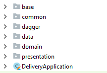

 - [Youtube Video Demo](https://youtu.be/zDnjU8Ew0yo)
 
# How to use ?
- you need to provide your Google Maps API key in google_maps_api.xml file 
   

## Technical Notes:

Used Kotlin programming language  for Applying MVVM architecture with the following topics  
- Clean architecture
- Test-driven development
- Dagger2- RxJava2
- ViewModels-LiveData

 ## Features:
1. Displaying list of items with its details 
2. Loading More feature 
3. Cacheing response.
4. swipe to delete item

## Project Description

I would like to show how I made the packages structure of the project For achieving The separation of concerns 

- ## Presentation layer 
    will include normal Activities , Fragments and ViewModels which will only handle rendering views and will follow MVVM pattern.

- ## Domain layer 
    With the Use Cases that  will include all business logic and interact between Data and Presentation layer by means of interface and     interactors. The objective is to make the domain layer independent of anything, so the business logic can be tested without 
    any dependency to external components.

- ##  Data layer 
    With the Repositories.

### Used libraries: ###
- [RxJava2](https://github.com/ReactiveX/RxJava)
- [RxAndroid](https://github.com/ReactiveX/RxAndroid)
- [Retrofit2](https://github.com/square/retrofit)
- [Android architecture components](https://developer.android.com/topic/libraries/architecture/index.html)
- [OkHttp](https://github.com/square/okhttp)
- [Picasso](https://github.com/square/picasso)

 ## Future Work:
 1- Customize Tablet View 
 
 2- Implement ios version with the Whole requirments Using (Flutter) 
